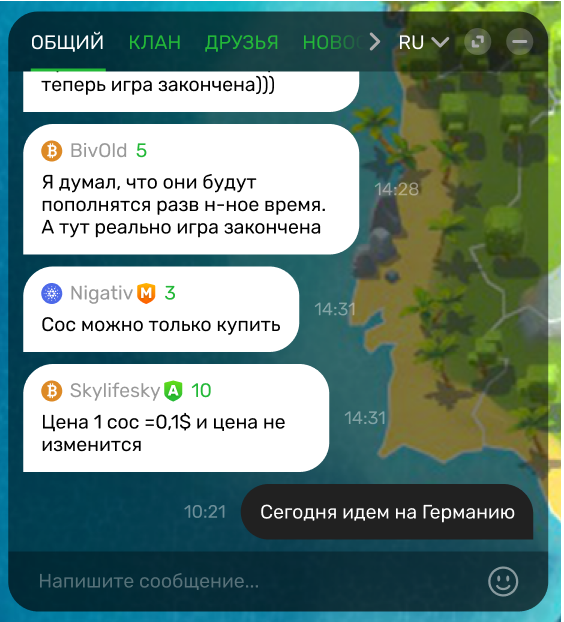
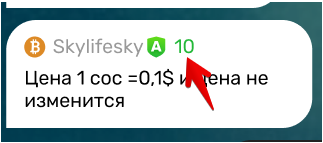

###Задача:

[Макет чата](https://www.figma.com/file/7yl0QaQEaQOcBzKSTaMz6O/%D0%A2%D0%B5%D1%81%D1%82%D0%BE%D0%B2%D0%BE%D0%B5-%D0%B7%D0%B0%D0%B4%D0%B0%D0%BD%D0%B8%D0%B5?node-id=133%3A520)
 
реализовать полностью рабочий клиент чата с версткой и подключением к тестовому бэкенду. Чат — React-приложение.



####Вёрстка

+ Чат — в левом нижнем углу, фон игры верстать не нужно, это просто картинка.
Сверстать чат на вкладке “Общий” со всеми сообщениями игроков, которые видно на макете. Остальные вкладки могут быть пустыми, но должна быть возможность переходить по ним.

+ Дропдаун с выбором языков должен открываться, языки: RU, EN, ZHO.
Сообщения будут только во вкладке RU.

**Вёрстка должна соответствовать макету: шрифты, иконки, отступы, цвета и т.п. Без фанатизма, но и без явных отхождений от макета.**

+ Значение уровня игрока должно быть случайным числом от 1 до 10 включительно.



+ Дополнительный плюс, если будет реализован ресайз и скрытие чата по кнопкам в правом верхнем углу.

####Подключение к тестовому бэкенду
+ Клиент чата нужно подключить к бэкенду, протестировать что все работает корректно. 

[Документация и ссылка для подключения доступны по ссылке:](https://docs.google.com/document/d/1oAvILgOfpXgrNeqDYnqcM7ft1naxAx-jhHcNt_gYV2A/edit?usp=sharing)

+ Сообщения которые будут приходить с бэкенда могут отличаться от сообщений с макета. Это нормально, но сообщения с макета тоже нужно сверстать.

####Требования к работе чата
1. Бесконечный скролл: должна быть возможность пролистать историю чата от начала до конца без падения производительности.
2. Должна быть возможность отправлять сообщения в чат.
    * Проверить что верстка не едет при отправке больших сообщений, на бэкенде лимит в 200 символов.

3. Обновление отправленных / полученных сообщений в реальном времени.


###Бэкенд
https://test-chat-backend-hwads.ondigitalocean.app/

Бэкенд для тестового задания доступен по [домену](https://test-chat-backend-hwads.ondigitalocean.app/):  . Он открыт сразу для двух типов подключения - HTTPS для получения истории сообщений и WSS для быстрого обмена сообщениями в реальном времени.

####История сообщений

Для того, чтобы получить историю сообщений из чата, достаточно отправить HTTPS запрос в /api/messages. Сообщения отсортированы по дате отправки в обратном порядке (самое новое сообщение будет первым в списке). Обязательными параметрами в запросе являются skip и limit - они нужны для реализации бесконечного скролла в чате. skip - количество сообщений с конца, которые нужно пропустить (чем дальше пользователь скроллит историю - тем больше должен становиться этот параметр). limit - количество сообщений, которое нужно загрузить. Рекомендуется его подобрать таким образом, чтобы:

1. выполнение запроса не занимало слишком много времени
2. запросы не отправлялись слишком часто


#####Пример запроса:
https://test-chat-backend-hwads.ondigitalocean.app/api/messages?skip=0&limit=15

Сообщения в истории имеют следующий вид:

```$xslt
{
  "id": "81d55d55-34ed-472f-9326-f7d8a7842a5b",
  "from": "username",
  "text": "Message text.",
  "createdAt": "2021-02-01T14:13:27.000Z"
}
```
- id - строка с id в формате UUID 4-ой версии
- from - имя пользователя, который отправил сообщение
- text - текст сообщения
- createdAt - дата и время отправки сообщения в формате ISO 8601


#####Отправка сообщений и подписка на новые

Реалтайм-часть бэкенда работает на socket.io v3.1.0. Для того, чтобы отправлять и получать новые сообщения, нужно с помощью библиотеки socket.io подключиться к следующему URL:

wss://test-chat-backend-hwads.ondigitalocean.app

По этому URL не поддерживается поллинг (подключение возможно только по WS), поэтому в socket.io при создании клиента нужно указать соответствущий конфиг (пример можно посмотреть [здесь](https://gist.github.com/rjkz808/1980599c6a6afedccf4f1b8b367a3c3c)).

**Чтобы получать новые сообщения из чата**, нужно подписаться на событие "message" в созданном клиенте socket.io. При срабатывании ивента в функцию-слушатель будет передаваться сообщение в том же формате, как и в истории (см. выше).
**Для отправки новых сообщений** необходимо через клиент socket.io отправить на сервер событие "message" с объектом такого вида:

```$xslt
{
  "from": "username",
  "text": "Message text."
}
```
- from - имя текущего пользователя. Может содержать только буквы латинского алфавита в верхнем и нижнем регистре (a-z и A-Z), цифры (0-9) и нижнее подчеркивание _ (не более одного подряд). В имени пользователя не может быть пробелов. Минимальная длина - 3, максимальная - 16.
- text - текст сообщения. Минимальный размер - 1 символ, максимальный - 200 символов.

Обязательным параметром также является коллбэк для обработки ошибок (передается последним). Если запрос имеет неправильный формат, либо на стороне сервера произошла какая-либо ошибка, в коллбэк будет передана строка с ее описанием. Если запрос был успешным, в коллбэк придет значение null. Пример отправки запроса можно посмотреть [здесь](https://gist.github.com/rjkz808/753b9b483c8b05901339c21df6a29cea).

**Важное дополнение:** клиент не получит событие "message" с тем сообщением, которое он сам отправил. Событие "message" рассылается всем подключенным клиентам, кроме отправителя. Ваше приложение должно самостоятельно отображать отправленное сообщение в UI.

